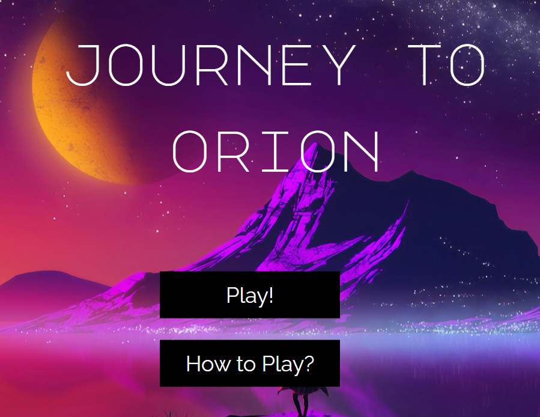

<h1 align="center">Journey to Orion</h1>
<h2 align="center">Computer Graphics</h2>

Final Project

Ago-Dic 2020
 

## Authors
- [Carla Pérez Gavilán](https://github.com/CarlaPerezGavilan)
- [Carlos García](https://github.com/cxrlos)
- [Juan Francisco Gortarez](https://github.com/)

## Link to Project:
[Journey 2 Orion](http://journey2orion.ga/game/)

## Description
Journey to Orion is a Space Exploration Simulator that puts you in the cockpit of a small spaceship in a big galaxy! Explore a vast 3D system with procedurally generated planets, ships, and asteroids, and attempt to reach different planets while keeping yourself safe from obstacles and avoiding collisions with tiny and not-so-tiny balls of rock. 

## Dependencies
The libraries used for the development are the following:
- [THREE.js](https://threejs.org/)
- [TWEEN.js](https://createjs.com/tweenjs)
- [JQuery](https://jquery.com/)

## Development Path (requirements)
1. Create the basic scene for the project; this will include the basic will include the basic illumination, camera and spaceship interior (dashboard).
2. Spaceship movement using the keyboard AWSD and mouse for rotation.
3. Environment generation: The environment will contain static planets with fixed rotation and translation values. These will be the same for every game but the starting point and goal will vary randomly.
4. Random generation of "AI-controlled" spaceships (random movement) and asteroids with varibale positions and rotation around random solar system.
5. Collision system between the user and its surrounding objects. "You Lost" message that appears when colliding when any object. 
6. Random assignation of target planet with a visual indicator that stays on screen regardless of player, arrow that points constantly to the target planet. 
7. Countdown to achieve mission (arrive at particular planet), and mission creation at random when simulation begins (displayed as target planet in dashboard). Distance difference between target planet and user is also displayed in dashboard. 
8. Interior sensors inside spaceships which will display the user's spaceship rotation and speed.
9. Development of interactive dashboard that will show useful information of the asteroid, planet or spaceship that are closest to the user using raycasting (distance and plaent's picture).
10. Respawn system that restarts the game in different positions,whenever the user dies due to a collision.

## How to Play
You spawn near a planet, and in your screen you will get a prompt for the first planet you need to visit. You must navigate ships, obstacle and obstacles to reach that planet, under time pressure! After you reach a planet,the time you have to reach the next planet will decrease, and so you must go FASTER. When you lose, you will be able to see the leaderboard, and compare your results with those that came before you!

## Gameflow
1. Initialize with inside spaceship PoV. 
2. Movement options with keyboard (right, left, up or down) and rotation options with mouseGeneral Work-flow
3. Update map position in dashboard to visualize mission completion status
4. Warning alerts when approaching objects generated randomly. 
5. Mission Complete: displays sign when reaching target planet. 
6. Display scoreboard and play again option. 

## Code Sections

The code is separated into distinct parts that will be described in a simple fashion in the following subsections:

### 1. System class
This class is used to model and create the three planetary systems that are present in the scene. It serves as a wrapper for multiple planets and their pivots

### 2. Planet class
This class is used to model and create each planet that is in the scene, along with its textures, pivot and moons (if applicable). 

### 3. Misc. Event Listeners (onKeyDown, onMouseMove, onCollision)
These event listeners are used to reduce the strain on the update function, by making certain that certain updates to speed, velocity, position, and so on are only made when necessary,and do not need to be constantly checked. OnKeyDown acts as a secondary movement controller, where you can use WASD to move through space instead of the mouse, onMouseMove returns the current position of the mouse for raycasting and proximity sensor purposes, and onCollision handles the update of the scoreboard and respawn mechanisms. 

### 4. Spaceship Generation (GenSpaceship, SpaceshipMultigen)
These functions are used to spawn an arbitrary number of spaceships in a user-delimited area, and they handle loading the model from an .obj, grouping, and randomized initial orientation and directions. GenSpaceship creates only one ship, while SpaceshipMultigen uses the former to create an arbitrary number of them. 

### 5. CreateScene
This function initializes most of the elements that will be needed for the game to function, such as the camera, lighting, FirstPersonControls, spaceship interior, clocks, and so forth, but it also loads the planets and spaceships into the scene using the previously mentioned functions. 

### 6. Run/Animate
This function runs every tick of in-game time and is responsible for the things that must update periodically, such as the planets' rotation, the spaceship's movement, the sensor  and text updates, and the "NPC" spaceship movement. 

### 7. AddPlanet
This function is used to insert a Planet object into the scene as part of a system, and render it. 

### 8. UpdateSpeed/Rotation
These functions run during animate but are separated so as to improve legibility, they are used to update the accelerometer and the gyroscope sensors depending on the spaceship's current movement direction and rotation.

### 9. LoadObj
This helper function is used to load a .obj object, create a 3d object, and assign it as a child of another object3d, passed as an argument. If the object is a spaceship it is also responsible for the initial randomized orientation. 

### 10. ScoreboardScene
This function helps control the scoreboard toggle, and it updates the board depending on the stats for your current run. 

### 11. getRandSys 
Returns random planet from a random solar system (3 options available). 

### 12. generateRandom 
Generates asteroids every 20 seconds in random positions that rotate around a sun of one of the three main solar systems. 

### 13. decreaseCounter 
It updates speed according to acceleration, if it is negative it is set to 0. If it is bigger than 0 it is decreased by the acceleration times 400 factor. 

### 14. resetCamera 
Select from 6 random positions to respawn camera once reached destination or everytime page is refreshed. 

### 15. timeSort 
Returns time difference between two moments in time, to determine absolute duration of journey. 

### 16. loserScene
Scene that appears when colliding with an asteroid, planet or spaceship. 

## Work Plan
- [TRELLO PLAN](https://trello.com/b/zfwuQ9vi)    

## License
The license information can be reviewed in the [LICENSE](https://github.com/cxrlos/Journey_to_Orion/blob/master/LICENSE) file.
